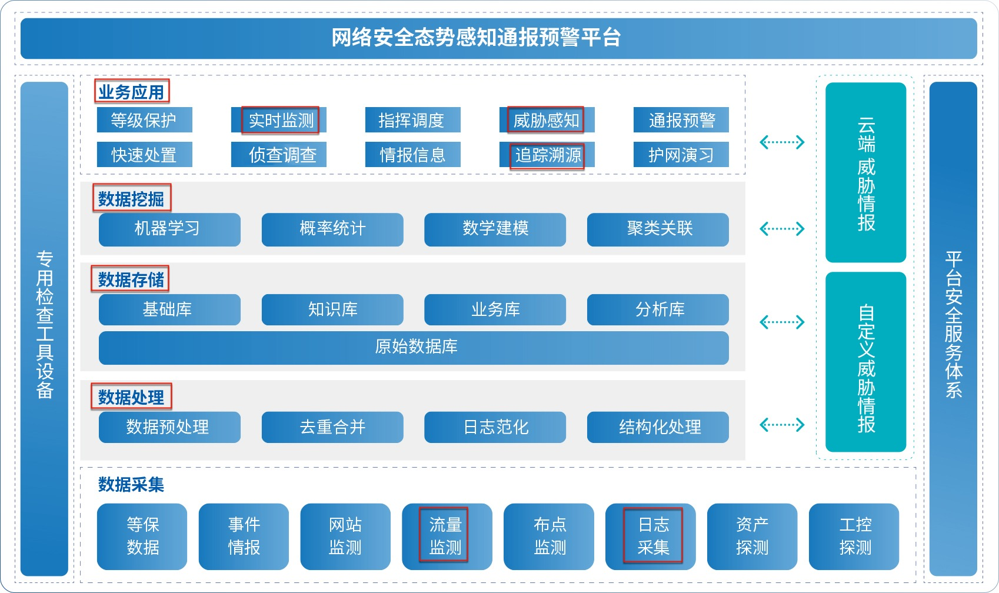

# 安全分析流程

* 安全分析的核心要点=总体流程
  * 总体流程图
    * 
  * 核心要点
    * **数据采集**
      * 数据源
        * 日志类
        * 流量类（原始数据包）
    * **数据处理**
      * `大数据`技术
        * `数据处理`：去重合并、日志泛化、结构化处理
        * `数据存储`：保存到相关数据库
      * `人工智能`技术
        * `数据挖掘`：机器学习、统计、关联、建模、统计
    * **数据应用**
      * 最终用户看到的、听到的：产品 = 功能 = 名词
        * `过去` = 静态的、历史的：`追踪溯源`
        * `现在` = 实时的：`实时监测`、`威胁感知`
        * `将来`：`威胁预警`
