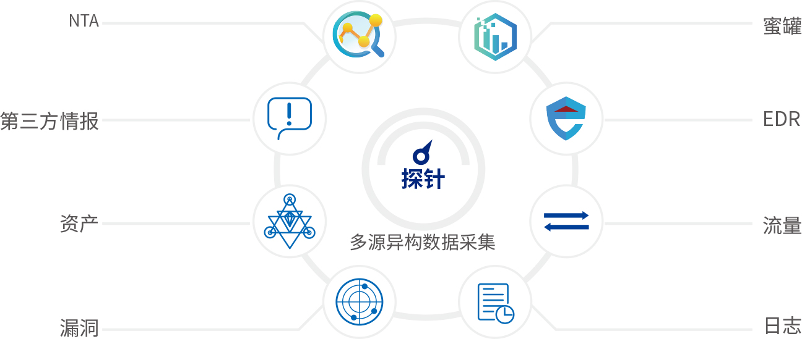

# 数据采集

安全分析的前提，是需要采集到对应的数据。

* 数据采集
  * (全方位全要素的)全量数据
    * 概述
      * 
    * 包含
      * 实时安全数据
        * 多种采集方式
          * 隐患主动探测
          * 日志采集
          * 流量分析
          * 蜜罐诱捕
      * 历史和相关数据
        * 日常运维管理的数据
          * 举例
            * 等保数据
        * 威胁情报数据
          * 安全事件
          * 资产测绘数据
          * 黑客组织信息
          * IP信誉
          * 域名测绘数据
        * 第三方标准接口获取的数据
        * (海量)指纹库
