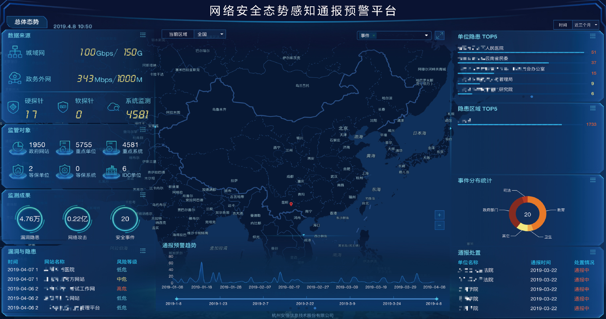

# 大数据

* 大数据
  * 大数据基础架构
  * 数据源
    * 多源异构数据
  * 操作
    * 处理
    * 存储
    * 查询
  * 涉及
    * 质量评定
    * 标签化
    * 数据补全
  * 相关
    * 机器学习
    * 关联分析
    * 场景建模
      * 场景
        * 举例
          * 入侵识别
            * 发现各类潜在威胁攻击

## 数据可视化

* 数据可视化
  * 工具
    * ELK
  * 应用
    * 网络空间监管可视
      * 态势感知可视化
        * 
      * 实现
        * 监管
          * 可见
          * 可管
          * 可控

## 关联分析

* 安全分析类产品
  * 涉及到关联分析
    * 相关概念
      * 日志分析
      * SOC
      * 态势感知
      * 风控
* 关联分析模型
  * 大概种类
    * 基于`规则`的关联分析
    * 基于`统计`的关联分析
    * 基于`威胁情报`的关联分析
    * 基于`情境`的关联分析
    * 基于`大数据`的关联分析
