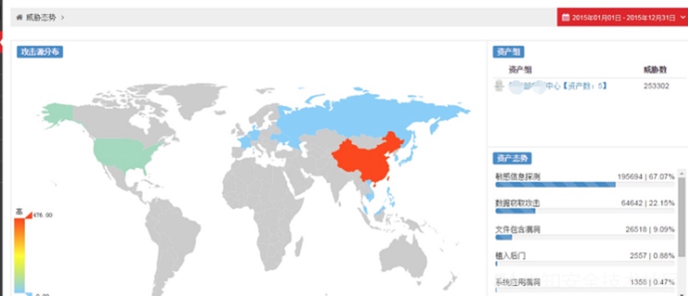
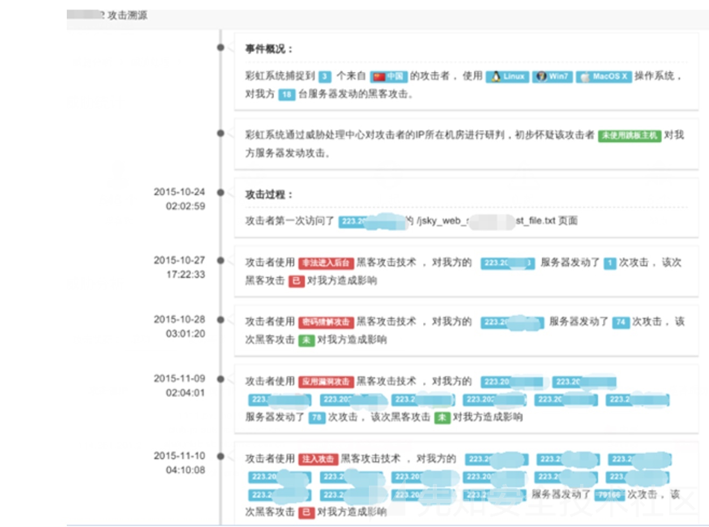
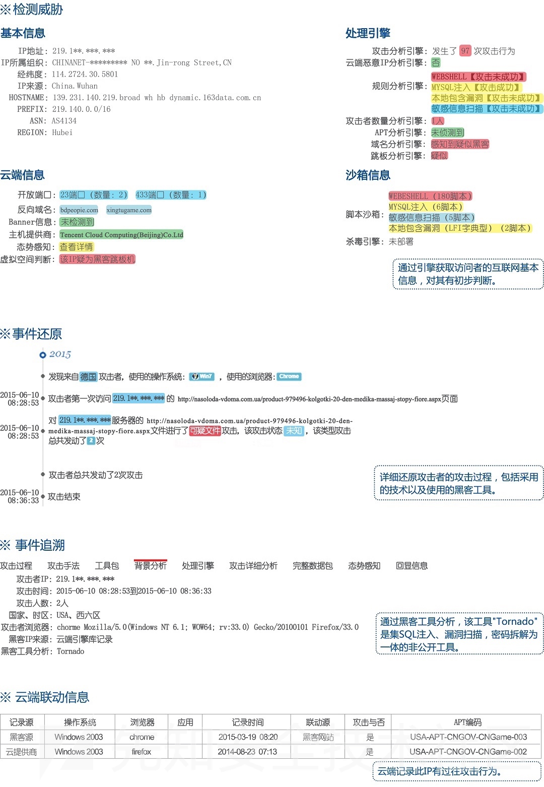

# 日志分析方法

## 分析日志的常规办法

* 分析日志的常规办法
  * 常规应急响应情况 = 常见的几种被黑情况
    * 带宽被占满，导致网站响应速度变慢，用户无法正常访问
    * 造成已知经济损失，客户被恶意转账、对账发现金额无端流失
    * 网站被篡改或者添加暗链，常见为黑客黑页、博彩链接等
  * 建议动作
    * 1. 先断网
      * 对已知被黑的服务器进行断网
    * 2. 再分析日志
      * 开始进行日志分析操作
  * 分析思路和对策
    * 对于相对初级的黑客：会上传webshell（后门文件）
      * 对策：检查是否存有明显的webshell
      * 检查方式
        * 搜索最近一周被创建、更新的脚本文件
        * 根据网站所用语言，搜索对应webshell文件常见的关键字
        * 后续操作
          * 找到webshell后门文件后
          * 通过查看日志中谁访问了webshell
          * 然后得出攻击者IP
          * 再通过IP提取出攻击者所有请求进行分析
      * 举例说明
        * 可能我们得到类似这样一个日志结果
            ```bash
            00:01  GET http://localhost/index.php 9.9.9.9  200  [正常请求]
            00:02  GET http://localhost/index.php?id=1' 9.9.9.9 500  [疑似攻击]
            00:05  GET http://localhost/index.php?id=1' and 1=user() or ''=' 9.9.9.9  500  [确认攻击]
            00:07 GET http://localhost/index.php?id=1' and 1=(select top 1 name from userinfo) or ''=' 9.9.9.9 500 [确认攻击]
            00:09 GET http://localhost/index.php?id=1' and 1=(select top 1 pass from userinfo) or ''=' 9.9.9.9 500 [确认攻击]
            00:10  GET http://localhost/admin/ 9.9.9.9 404 [疑似攻击]
            00:12  GET http://localhost/login.php 9.9.9.9 404 [疑似攻击]
            00:13  GET http://localhost/admin.php 9.9.9.9 404 [疑似攻击]
            00:14  GET http://localhost/manager/ 9.9.9.9  404 [疑似攻击]
            00:15  GET http://localhost/admin_login.php 9.9.9.9 404 [疑似攻击]
            00:15  GET http://localhost/guanli/ 9.9.9.9 200 [疑似攻击]
            00:18  POST http://localhost/guanli/ 9.9.9.9 200 [疑似攻击]
            00:20  GET http://localhost/main.php 9.9.9.9 200 [疑似攻击]
            00:20  POST http://localhost/upload.php 9.9.9.9 200 [疑似攻击]
            00:23  POST http://localhost/webshell.php 9.9.9.9 200 [确认攻击]
            00:25  POST http://localhost/webshell.php 9.9.9.9 200 [确认攻击]
            00:26  POST http://localhost/webshell.php 9.9.9.9 200 [确认攻击]
            ```
            * 注：为清晰呈现攻击路径，此日志为人工撰造
          * 通过找到后门文件`webshell.php`，得知攻击者IP为`9.9.9.9`
          * 提取了此IP所有请求
          * 从这些请求可以清楚看出攻击者从`00:01`访问网站首页
          * 然后使用了单引号对网站进行SQL注入探测
          * 然后利用报错注入的方式得到了用户名和密码
          * 随后扫描到了管理后台进入了登录进了网站后台
          * 上传了webshell文件
          * 进行了一些恶意操作
        * 结论
          * 从以上分析我们可以得出，`/index.php`这个页面存在SQL注入漏洞
            * 后台地址为`/guanli.php`,`/upload.php`可直接上传`webshell`
        * 补救方法
          * 修复注入漏洞
          * 更改管理员密码
          * 对文件上传进行限制
          * 限制上传目录的执行权限
          * 删除webshell

## 攻击溯源

* 攻击溯源
  * 背景：由于各种原因，实现攻击溯源难度较大
  * 已知=现状
    * 某些甲方内部安全团队有尝试实现过，但至今未要到产品实现的效果图
    * 某人找到某安全公司有一个类似的产品，以硬件方式实现的流量监控，从而获取到日志进行分析
      * 可以记录并分析整个请求包和响应包
        * 这可比从日志文件中拿到的信息全面多了
          * 从而将日志溯源分析降低了一个难度
          * 信息
            * 请求和响应数据完整，能进行更大维度的日志分析
            * **安全关联库**较多，能关联出更为丰富的信息
        * 推测
          * 他们内部有一个IP库，每个IP是否为代理IP，所处什么机房都有相应的记录
            * 或者调用了IP位置查询接口，从而判断IP是否为代理IP、机房IP、个人上网出口IP，继而判定未使用跳板主机
      * 效果图
        * 
        * 
        * 
  * 其他更好的思路
    * 正常总是基本相似，异常却各有各的异常
      * -> 用**大数据**（统计、建模）实现
        * 搜集大量正常请求，为每个请求的所有参数的值定义正常模型
        * 通过Waf或者攻击规则来剔除所有发起过攻击请求的IP
          * 从而得到所有来自用户的正常请求，将每个正常请求构造出对应的正常模型
            * 比如
              * http://test.com/index.php?id=123
              * http://test.com/index.php?id=124
              * http://test.com/index.php?id=125
        * 那么关于此请求的正常模型则为`[N,N,N]`,不匹配此模型的请求则为异常请求
        * 效果
          * 当对日志中的请求建立完正常的模型，通过正常模型来匹配找出所有不符合模型的请求时，发现效果的确不错

## 安全关联库

* 安全关联库
  * 举例
    * 全球IPV4信息知识库
      * 包括该IP对应的国家地区、对应的操作系统详情、浏览器信息、电话、域名等等。并对全球IP地址实时监控，通过开放的端口、协议以及其历史记录，作为数据模型进行预处理
    * 全球虚拟空间商的IP地址库
      * 如果访问者属于该范围内，则初步可以判定为跳板IP
    * 全球域名库
      * 包括两亿多个域名的详细信息，并且实时监控域名动向，包括域名对应的IP地址和端口变化情况，打造即时的基于域名与IP的新型判断技术，通过该方式可以初步判断是否为C&C服务器、黑客跳板服务器
    * 黑客互联网信息库
      * 全球部署了几千台蜜罐系统，实时收集互联网上全球黑客动向
    * 独有的黑客IP库
      * 对黑客经常登录的网站进行监控、对全球的恶意IP实时获取
    * 黑客工具指纹库
      * 收集了所有公开的（部分私有的）黑客工具指纹，当攻击者对网站进行攻击时，可以根据使用的黑客工具对黑客的地区、组织做初步判断
    * 黑客攻击手法库
      * 收集了大量黑客攻击手法，以此来定位对应的黑客或组织
    * 其他互联网安全厂商资源
      * 该系统会充分利用互联网各种资源，比如联动50余款杀毒软件，共同检测服务器木马程序