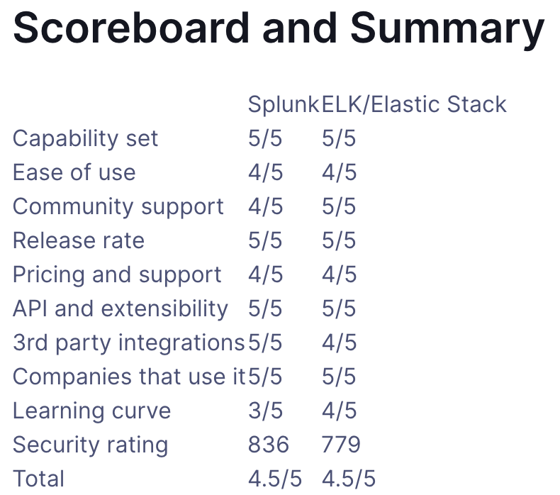

# 日志分析工具

* 分析日志具体如何操作？
  * 最基本的：用命令
    * 缺点：效率低
  * 引申=高级的：自动化（的日志分析）工具

## 日志分析工具

* 名称
  * `日志分析工具`
    * ~=`日志管理方案`=`Log Management Solution`
      * ~=`日志管理和分析方案`=`Log Management and Analysis Solutions`
    * ~=`SIEM`=`Security Information and Event Management`=`安全信息和事件管理`
* 概述
  * 主流日志分析工具
    * `ELK`
      * `ELK`=`ElasticSearch`、`Logstash`、`Kiabana`
    * `Splunk`
* 详解
  * 日志分析工具
    * Win
      * `Log Parser`
        * 微软强大的日志分析工具
      * `Event Viewer`=`事件查看器`
      * `Weblog expert`
        * windows日志分析工具
    * 其他
      * `MSSQL_logview`
      * `Splunk`
      * `SysTools NTFS Log Analyzer`
      * `ELK`
    * Linux
      * `Webtrends`
      * `AWStats`
      * `Webalizer`
      * `Analog`
      * `Summary`
      * `Urchin`
    * Nginx
      * 模块
        * `nginx_upstream_check_module`
          * 检查后端服务器的健康情况
      * Nginx日志分析工具
        * `Goaccess`
  * 日志分析系统或服务
    * 日志易
      * https://www.rizhiyi.com/
        * 
        * 
    * 安全易
      * https://www.anquanyi.com/
        * 
        * 

## 相关

### 日志分析工具中和安全相关的功能

* 日志分析工具中和安全相关的功能
  * 普通功能
    * 威胁时序图
    * 疑似威胁分析
    * 疑似威胁漏报分析
    * 威胁访问流量
    * 威胁流量占比
    * 境外威胁来源国家(地区)统计
    * 境内威胁来源城市统计
    * 威胁严重度
    * 威胁响应分析
    * 恶意IP
    * 恶意URL分析
    * 威胁类型分析
    * 威胁类型分布
    * 威胁分类计数
    * 威胁来源热力图
    * 威胁总数
    * 威胁日志占比
  * 攻击溯源
    * 相关统计
      * 网站受攻击次数排名
      * 网站高危请求排名
      * 网站攻击者数量排名
      * 网站受攻击页面排名
      * 可疑文件排行
      * 被攻击时间统计
      * 攻击来源分布
      * 高危攻击者排行
      * 攻击者攻击次数排行
      * 网站危险系数排行
      * 攻击者数量统计
      * 各站点攻击者数量统计
      * 各扫描器占比
      * 使用扫描器攻击者统计

## 常见日志系统

* 常见日志系统
  * `Scribe`：Facebook
  * `Chukwa`：Apache
  * `Kafka`：Linkedin
  * `Flume`：Cloudera

### 日志管理服务

* 日志管理服务
  * Linux系
    * `rsyslogd`：普通日志管理服务
    * `klogd`：内核信息日志文件服务
    * `logrotate`：日志文件轮替服务

### ELK vs Splunk

