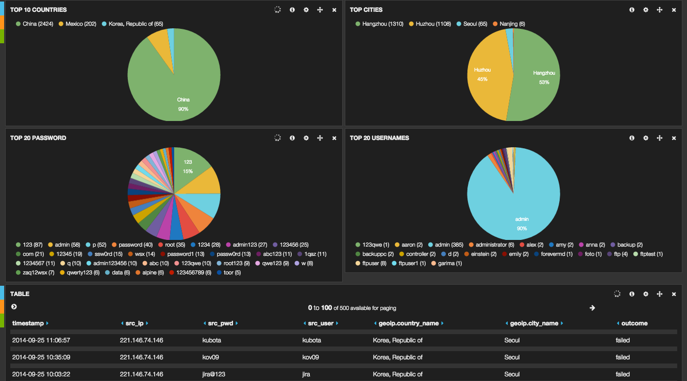
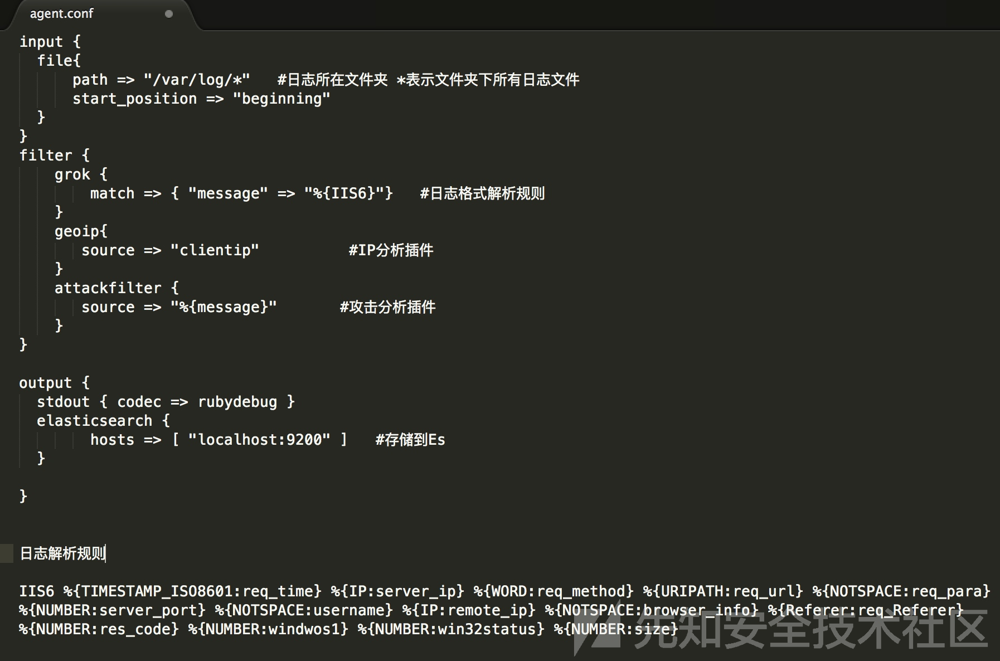
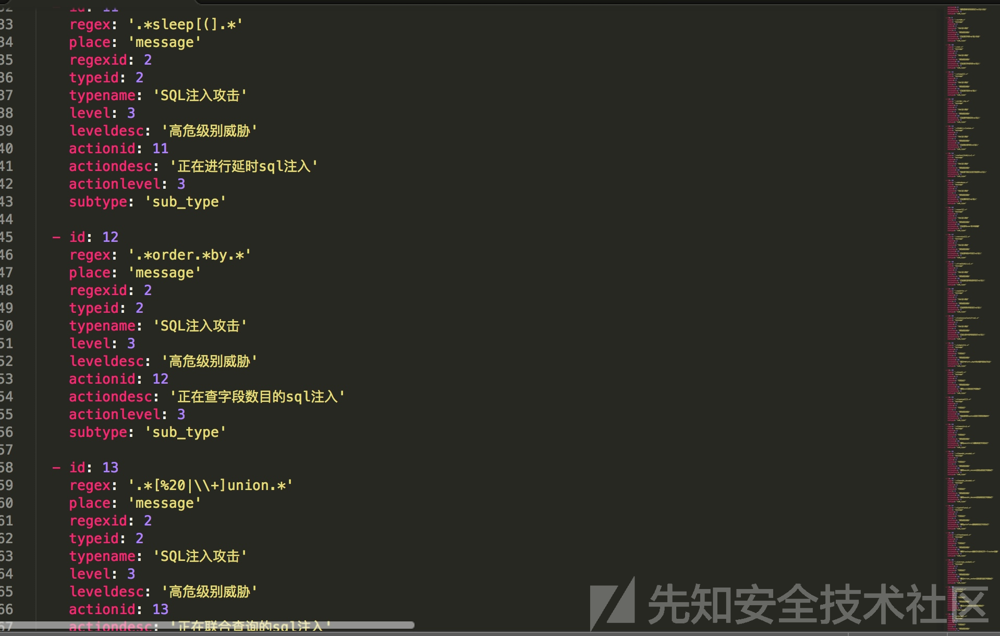
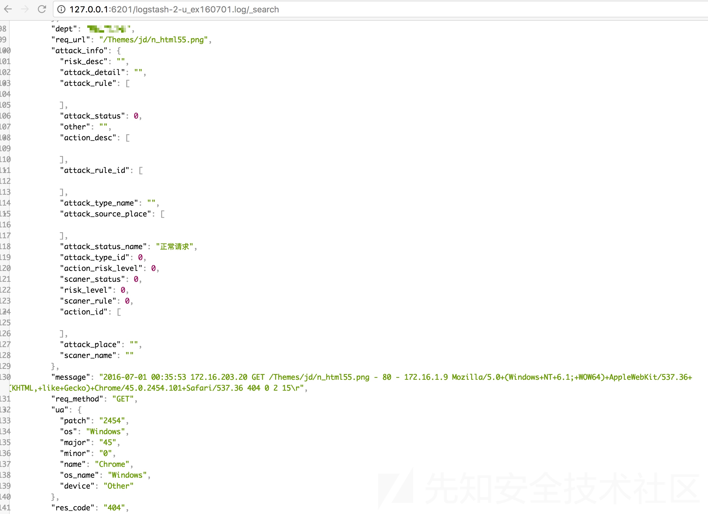
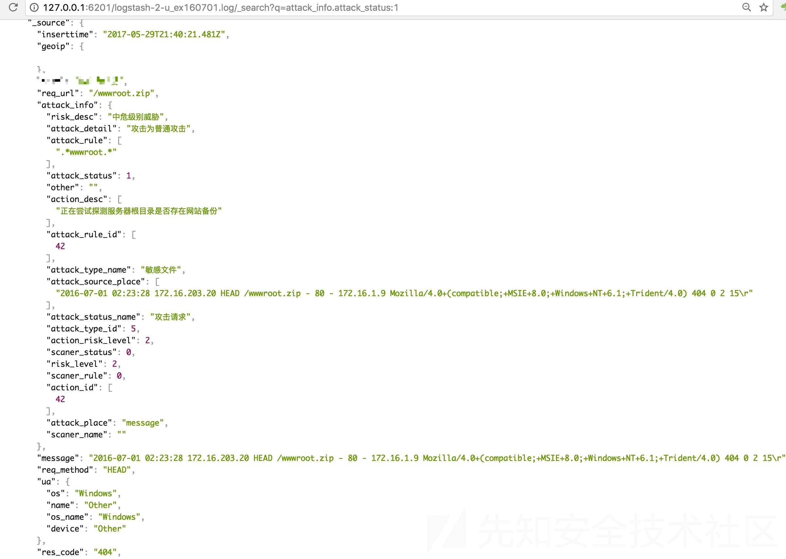
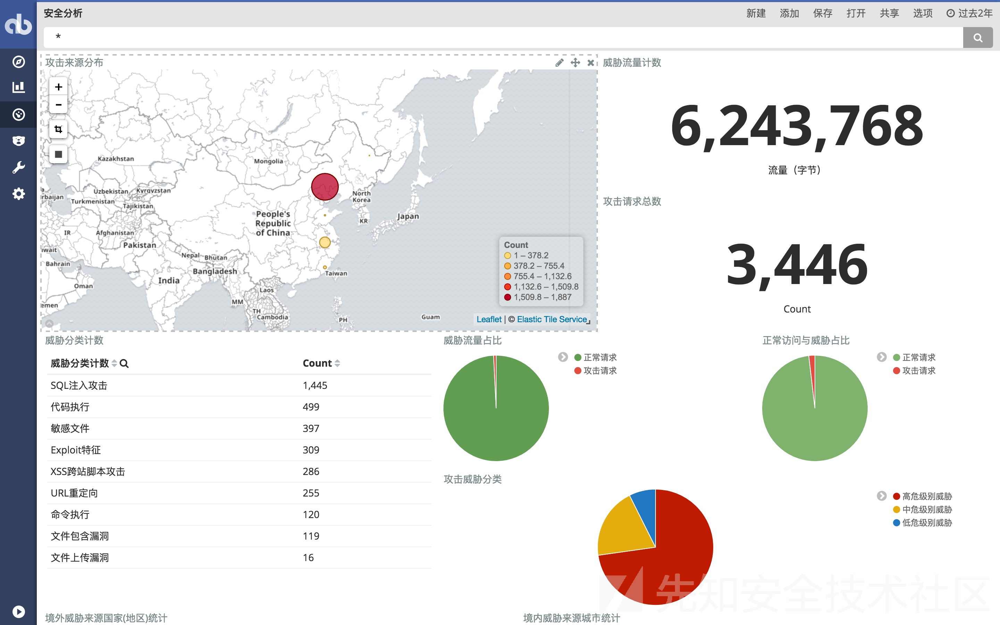
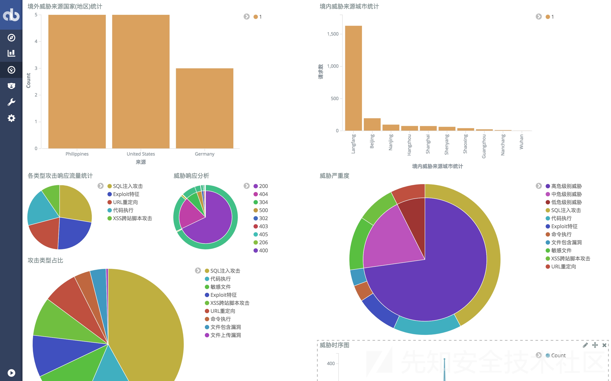

# ELK

* `ELK`
  * 名称
    * `ELK`=`ElasticSearch` + `Logstash` + `Kibana`
    * 别称
      * `Elastic Stack`
      * ~=`BELK`
        * =`Beats`+`ELK` = `Beats` + `ElasticSearch` + `Logstash` + `Kibana`
  * 组成详解
    * `ElasticSearch`：基于RESTful的、开源的、分布式的、搜索(查询和分析)引擎
      * 基于：`Apache Lucene`
      * 谁开发的：`Elastic`公司
    * `Logstash`：数据处理管道
      * 对日志进行收集、过滤并存储到Elasticsearch或其他数据库
    * `Kibana`：数据可视化
      * 对日志分析友好的Web界面,可对Elasticsearch中的数据进行汇总、分析、查询
      * 截图
        * 
  * 是什么：`数据分析平台`=`Data Analytics Platform`
    * 可用作：开源日志分析平台
  * 特点：开源、免费、高可配
    * -> 很多初创企业，作为日志分析平台，使用率最高

## ELK日志分析基本流程

* ELK日志分析基本流程
  * 编写Logstash配置文件
    * 
  * 将攻击规则应用于logstash的filter插件
    * 
  * 利用载入了安全分析插件后的logstash进行日志导入
    * 
  * 查询分析结果
    * 
    * 
  * 利用Kibana进行统计、可视化
    * 
    * 

