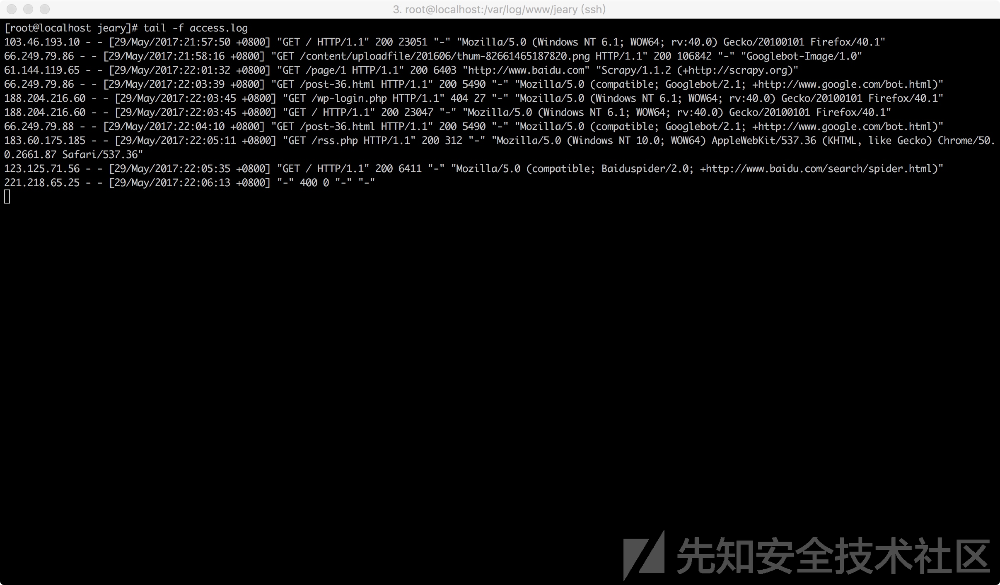
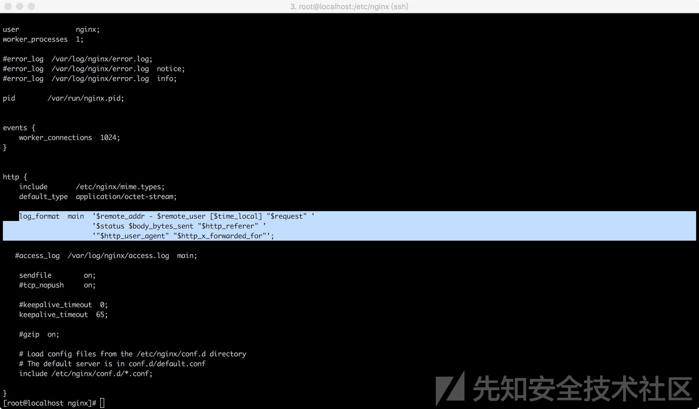

# 常见系统日志

* 日志
  * 多种系统
    * Nginx
      * 日志举例
        * 
          * 其中一条
            ```bash
            61.144.119.65 - - [29/May/2017:22:01:32 +0800] "GET /page/1 HTTP/1.1" 200 6403 "http://www.baidu.com" "Scrapy/1.1.2 (+http://scrapy.org)"
            ```
        * 对应nginx配置
          * 
            * 日志格式
              * `$remote_addr - $remote_user [$time_local] "$request" '$status $body_bytes_sent "$http_referer" '$http_user_agent" "$http_x_forwarded_for"';`
              * 翻译成中文
                * `远程IP - 远程用户  服务器时间 请求主体 响应状态 响应体大小 请求来源 客户端信息 客户端代理IP`

## 黑客攻击相关日志

* 背景
  * 站在攻击者的角度，攻击者对网站进行渗透时，其中包含大量的扫描请求和执行恶意操作的请求
    * 这两者在日志中都有各自的特征
      * 扫描请求会访问大量不存在的地址
        * 日志中的体现：大量的响应状态码为404
      * 不同的恶意请求都有各自相应的特征
* 举例
  * 恶意请求
    * 当有人对服务器进行SQL注入漏洞探测时
      * 以`select`为关键字进行过滤
        * 
      * 对策
        * 加上时间条件，状态码等条件，能查询到最近可能成功的SQL注入攻击
          * 注：
            * 实际情况中，会有很多噪声数据
              * 仅仅只依靠状态码来判断攻击是否成功是不可行的
                * 因为很多时候请求的确成功了，但并不能代表攻击也成功了
                  * 举例
                    * 请求一个静态页面或者图片，会产生这样一个请求
                      * `/logo.png?attack=test';select/**/1/**/from/**/1`
                      * 请求状态码为200，但是此注入攻击并没有得到执行
